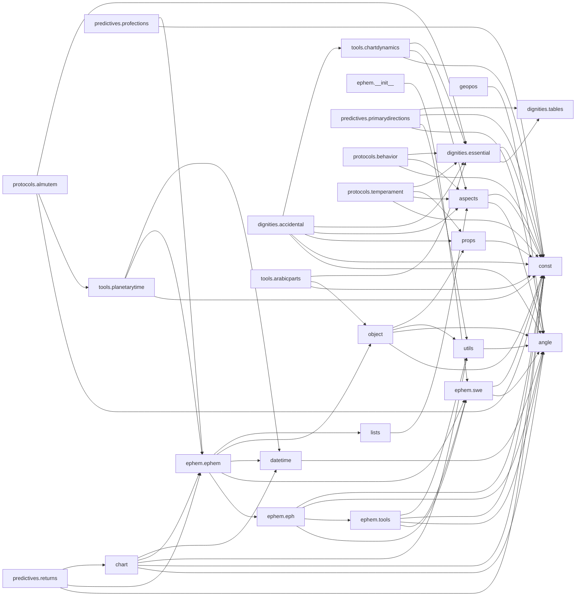

# Task 001 — Recon and Baseline

Generated: 2026-05-07
Branch: `task-001-recon`
Working tree: clean at start, no source files modified during recon.

This document is a baseline snapshot of the inherited codebase. No code
changes were made during this task. All measurements were taken in a
throwaway venv at `.venv-recon/` (not committed; see `.gitignore`
`venv/` rule — directory was named `.venv-recon` and is left for the
next task to inherit or delete).

## Environment used

| Tool          | Version    | Notes |
|---------------|------------|-------|
| Python        | **3.14.3** | The only Python on this Mac. The contribution plan targets 3.10–3.12. Python 3.14 is *newer* than the target, so anything that breaks here will likely also break on 3.12 — but a few warnings (e.g. deprecation of `datetime.utcnow`) might be 3.14-specific. **Recommendation:** install 3.12 via pyenv before Task 004 to verify against the actual CI matrix. |
| pytest        | 9.0.3      | Plugin: `pytest-cov 7.1.0` |
| ruff          | 0.15.12    | Default rule set used (no pyproject.toml yet) |
| mypy          | 2.0.0      | `--ignore-missing-imports` used because pyswisseph has no stubs |
| pyswisseph    | 2.10.3.2   | Pinned in `requirements.txt` and `setup.py` |

Install command actually used:

```sh
python3 -m venv .venv-recon
.venv-recon/bin/pip install pytest pytest-cov ruff mypy pyswisseph==2.10.3.2
.venv-recon/bin/pip install -e .
```

The editable install was required for tests to find `flatlib` — there
is no `conftest.py` adding `sys.path`. Worth remembering for Task 002.

---

## 1. Module inventory

All Python source files under `flatlib/`. Public API = top-level
classes and functions whose name does not start with `_`. Module-level
constants are listed only when they are part of how a consumer
configures the module.

Every `.py` file under `flatlib/` was last touched on
`2021-04-07 17:19:27 +0100` in the upstream "Code cleanup" commit,
**except** `flatlib/ephem/swe.py`, which was patched on
`2026-04-29 14:35:39 +0100` ("Refactor rise_trans call with updated
parameters"). I therefore list the date column only for the swe.py
exception and group every other file under a single date.

Last commit for the rest of `flatlib/`:
`2021-04-07 — "Code cleanup" (João Ventura)`. Five years of stasis.

### Top-level modules

| Path | Purpose | Public API | Internal imports | External imports | LoC |
|---|---|---|---|---|---:|
| `flatlib/__init__.py` | Package metadata + resource paths. | `__version__`, `PATH_LIB`, `PATH_RES` | — | `os` | 13 |
| `flatlib/angle.py` | Angular utilities and base-60 conversions between angle strings, signed lists, and floats. | `norm`, `znorm`, `distance`, `closestdistance`, `strSlist`, `slistStr`, `slistFloat`, `floatSlist`, `strFloat`, `floatStr`, `toFloat`, `toList`, `toString` | — | `math` | 137 |
| `flatlib/aspects.py` | Computes aspects (conjunction, sextile, square, trine, opposition, plus minor aspects) between chart objects, including movement (applicative/separative/exact) and direction. | `aspectType`, `hasAspect`, `isAspecting`, `getAspect`, `MAX_MINOR_ASP_ORB`, `MAX_EXACT_ORB`, classes `AspectObject`, `Aspect` | `angle`, `const` | — | 335 |
| `flatlib/chart.py` | Top-level `Chart` class — the main user-facing entry point. Bundles a `Datetime`, `GeoPos`, house system, and computed objects/houses/angles. | class `Chart` | `angle`, `const`, `utils`, `ephem.ephem`, `datetime.Datetime` | — | 164 |
| `flatlib/const.py` | String constants for signs, planets, houses, angles, fixed stars, aspects, plus `LIST_*` collections. | All UPPER_CASE constants and `LIST_*` lists. | — | — | 291 |
| `flatlib/datetime.py` | `Date`, `Time`, `Datetime` classes with Julian-Day-Number conversions; supports both Gregorian and Julian calendars. | `dateJDN`, `jdnDate`, classes `Date`, `Time`, `Datetime`, constants `GREGORIAN`, `JULIAN` | `angle` | — | 212 |
| `flatlib/geopos.py` | `GeoPos` class for "38n32"/"8w54"-style geographic positions. | `toFloat`, `toList`, `toString`, class `GeoPos`, constants `LAT`, `LON`, `SIGN`, `CHAR` | `angle` | — | 94 |
| `flatlib/lists.py` | Dict-backed list wrappers for objects, houses, fixed stars. | classes `GenericList`, `ObjectList`, `HouseList`, `FixedStarList` | `aspects` | — | 105 |
| `flatlib/object.py` | Object models: `GenericObject`, `Object` (planet), `House`, `FixedStar`. | classes `GenericObject`, `Object`, `House`, `FixedStar` | `const`, `angle`, `utils`, `props` | — | 267 |
| `flatlib/props.py` | Static property tables (orbs, mean motions, gender/faction/element of planets, sign modes, fertility, etc.) wrapped in lowercase classes used as namespaces. | classes `base`, `sign`, `object`, `house`, `aspect`, `fixedStar`, `houseSystem` | `const` | — | 351 |
| `flatlib/utils.py` | Math helpers: ascensional difference, diurnal/nocturnal arcs, equatorial-coordinate conversion, above-horizon test. | `ascdiff`, `dnarcs`, `isAboveHorizon`, `eqCoords` | `angle` | `math` | 77 |

### `flatlib/dignities/`

| Path | Purpose | Public API | Internal imports | External imports | LoC |
|---|---|---|---|---|---:|
| `flatlib/dignities/__init__.py` | Subpackage marker. | — | — | — | 9 |
| `flatlib/dignities/accidental.py` | Accidental dignities — Sun relations (combust/cazimi/under-the-sun), light, orientality, haiz, void-of-course, feral, scoring. | `sunRelation`, `light`, `orientality`, `viaCombusta`, `haiz`, class `AccidentalDignity`, constants `COMBUST/CAZIMI/UNDER_SUN/LIGHT_*/ORIENTAL/OCCIDENTAL/HAIZ/CHAIZ/HOUSE_SCORES` | `flatlib.angle`, `flatlib.dignities` (unused), `flatlib.const`, `flatlib.props`, `flatlib.aspects`, `flatlib.dignities.essential`, `flatlib.tools.chartdynamics.ChartDynamics` | `copy.copy` | 479 |
| `flatlib/dignities/essential.py` | Essential dignities — ruler, exalt, triplicities, terms, faces, scores, almutem; per-object `EssentialInfo`. | `setFaces`, `setTerms`, `ruler`, `exalt`, `exaltDeg`, `dayTrip`, `nightTrip`, `partTrip`, `exile`, `fall`, `fallDeg`, `term`, `face`, `getInfo`, `isPeregrine`, `score`, `almutem`, class `EssentialInfo`, constants `CHALDEAN_FACES`, `TRIPLICITY_FACES`, `EGYPTIAN_TERMS`, `TETRABIBLOS_TERMS`, `LILLY_TERMS`, `FACES`, `TERMS`, `TABLE`, `SCORES` | `tables`, `flatlib.const` | — | 231 |
| `flatlib/dignities/tables.py` | The static dignity tables: face variants, term variants (Egyptian/Tetrabiblos/Lilly), and `ESSENTIAL_DIGNITIES`. | `SIGN_LIST`, `CHALDEAN_FACES`, `TRIPLICITY_FACES`, `EGYPTIAN_TERMS`, `TETRABIBLOS_TERMS`, `LILLY_TERMS`, `ESSENTIAL_DIGNITIES`, `termLons` | — | — | 490 |

### `flatlib/ephem/`

| Path | Purpose | Public API | Internal imports | External imports | LoC | Last commit |
|---|---|---|---|---|---:|---|
| `flatlib/ephem/__init__.py` | Configures the swisseph file path on import. | `setPath` | `flatlib`, `swe` | — | 23 | 2021-04-07 "Code cleanup" |
| `flatlib/ephem/eph.py` | Mid-layer between Swiss Ephemeris and flatlib — returns plain dicts with sign info attached. | `getObject`, `getHouses`, `getFixedStar`, `nextSolarReturn`, `prevSolarReturn`, `nextSunrise`, `nextSunset`, `lastSunrise`, `lastSunset`, `nextStation` | `swe`, `tools`, `flatlib.angle`, `flatlib.const` | — | 124 | 2021-04-07 |
| `flatlib/ephem/ephem.py` | Top-level ephemeris facade — wraps `eph` results in flatlib `Object`, `House`, `FixedStar`, etc. This is what `Chart` actually calls. | `getObject`, `getObjectList`, `getHouses`, `getHouseList`, `getAngleList`, `getFixedStar`, `getFixedStarList`, `nextSolarReturn`, `prevSolarReturn`, `nextSunrise`, `nextSunset`, `lastSunrise`, `lastSunset`, `nextStation`, `prevSolarEclipse`, `nextSolarEclipse`, `prevLunarEclipse`, `nextLunarEclipse` | `eph`, `swe`, `flatlib.datetime.Datetime`, `flatlib.object.{GenericObject, Object, House, FixedStar}`, `flatlib.lists.{GenericList, ObjectList, HouseList, FixedStarList}` | — | 166 | 2021-04-07 |
| `flatlib/ephem/swe.py` | Direct wrapper around `swisseph` (the pyswisseph C bindings). | `setPath`, `sweObject`, `sweObjectLon`, `sweNextTransit`, `sweHouses`, `sweHousesLon`, `sweFixedStar`, `solarEclipseGlobal`, `lunarEclipseGlobal`, mappings `SWE_OBJECTS`, `SWE_HOUSESYS` | `flatlib.angle`, `flatlib.const` | `swisseph` | 178 | **2026-04-29 "Refactor rise_trans call with updated parameters"** |
| `flatlib/ephem/tools.py` | Iterative algorithms (Pars Fortuna, syzygy, solar-return, station). | `pfLon`, `isDiurnal`, `syzygyJD`, `solarReturnJD`, `nextStationJD`, `MAX_ERROR` | `swe`, `flatlib.angle`, `flatlib.const`, `flatlib.utils` | — | 107 | 2021-04-07 |

### `flatlib/predictives/`

| Path | Purpose | Public API | Internal imports | External imports | LoC |
|---|---|---|---|---|---:|
| `flatlib/predictives/__init__.py` | Subpackage marker. | — | — | — | 9 |
| `flatlib/predictives/primarydirections.py` | Primary directions (Ptolemy/Placidus semi-arc method). Encodes promissor/significator pairs through helper functions `T/A/C/D/S/N`. | `arc`, `getArc`, classes `PrimaryDirections`, `PDTable` | `flatlib.angle`, `flatlib.utils`, `flatlib.const`, `flatlib.dignities.tables` | — | 333 |
| `flatlib/predictives/profections.py` | Annual profections — rotates a chart 30° per year. | `compute` | `flatlib.const`, `flatlib.ephem.ephem` | `math` | 44 |
| `flatlib/predictives/returns.py` | Solar return charts (lunar returns mentioned but not yet implemented). | `nextSolarReturn`, `prevSolarReturn` | `flatlib.const`, `flatlib.ephem.ephem`, `flatlib.chart.Chart` | — | 45 |

### `flatlib/protocols/`

| Path | Purpose | Public API | Internal imports | External imports | LoC |
|---|---|---|---|---|---:|
| `flatlib/protocols/__init__.py` | Subpackage marker. | — | — | — | 9 |
| `flatlib/protocols/almutem.py` | Almutem protocol — score per planet across hylegic points, houses, planetary rulers. | `compute`, `newRow`, constants `HOUSE_SCORES`, `DIGNITY_LIST`, `OBJECT_LIST` | `flatlib.const`, `flatlib.tools.planetarytime`, `flatlib.dignities.essential` | — | 117 |
| `flatlib/protocols/behavior.py` | "Behavior" protocol — collects planets influencing personality. | `compute` | `flatlib.const`, `flatlib.aspects`, `flatlib.dignities.essential` | — | 69 |
| `flatlib/protocols/temperament.py` | Temperament classification (choleric/melancholic/sanguine/phlegmatic) from Asc, Moon, Sun-season factors and modifiers. | `singleFactor`, `modifierFactor`, `getFactors`, `getModifiers`, `scores`, class `Temperament`, plus factor and modifier constants | `flatlib.const`, `flatlib.dignities` (unused), `flatlib.aspects`, `flatlib.props`, `flatlib.dignities.essential` | — | 270 |

### `flatlib/tools/`

| Path | Purpose | Public API | Internal imports | External imports | LoC |
|---|---|---|---|---|---:|
| `flatlib/tools/__init__.py` | Subpackage marker. | — | — | — | 9 |
| `flatlib/tools/arabicparts.py` | Arabic Parts (Pars Fortuna, Spirit, Faith, Substance, etc., 20 in total) with diurnal/nocturnal formulas. | `objLon`, `partLon`, `getPart`, the 20 `PARS_*` ID constants, `FORMULAS` dict | `flatlib.const`, `flatlib.object.GenericObject`, `flatlib.dignities.essential` | — | 185 |
| `flatlib/tools/chartdynamics.py` | `ChartDynamics` — dignities, mutual receptions, applying/separating aspects, void of course. | class `ChartDynamics` | `flatlib.const`, `flatlib.aspects`, `flatlib.dignities.essential` | — | 149 |
| `flatlib/tools/planetarytime.py` | Planetary hour table (day/night rulers, current hour ruler, Chaldean order). | `nthRuler`, `hourTable`, `getHourTable`, class `HourTable`, lists `DAY_RULERS`, `NIGHT_RULERS`, `ROUND_LIST` | `flatlib.const`, `flatlib.ephem.ephem`, `flatlib.datetime.Datetime` | — | 183 |

### Resources (non-Python)

`flatlib/resources/swefiles/` ships ~10 `.se1` Swiss Ephemeris data
files (planets, moon, asteroids, three time-window variants each) plus
`fixstars.cat` and `sefstars.txt`. These are loaded at import via
`swe.set_ephe_path()` in `flatlib/ephem/__init__.py`. They are part of
the package data per `setup.py`.

**Total source LoC across `flatlib/`: 5,275** (32 `.py` files,
including six tiny `__init__.py` markers).

---

## 2. Test suite baseline

There are **2 test files, 5 test functions**, both `unittest.TestCase`
based:

| File | Tests |
|---|---|
| `tests/test_angles.py` | `test_norm`, `test_znorm`, `test_distances`, `test_closest_distances` |
| `tests/test_chart.py`  | `test_solar_return_hsys` |

Coverage is essentially angle math + a one-line check that solar
returns preserve `hsys`. Nothing else is tested at all.

### Run results

```
$ .venv-recon/bin/pytest -v tests/
============================= test session starts ==============================
platform darwin -- Python 3.14.3, pytest-9.0.3, pluggy-1.6.0
collected 5 items

tests/test_angles.py::AngleTests::test_closest_distances PASSED          [ 20%]
tests/test_angles.py::AngleTests::test_distances PASSED                  [ 40%]
tests/test_angles.py::AngleTests::test_norm PASSED                       [ 60%]
tests/test_angles.py::AngleTests::test_znorm PASSED                      [ 80%]
tests/test_chart.py::ChartTests::test_solar_return_hsys PASSED           [100%]

============================== 5 passed in 0.56s ===============================
```

- Total:    **5**
- Passing:  **5**
- Failing:  0
- Errors:   0
- Skipped:  0

Caveat from a first run: when you simply do `pytest` without first
running `pip install -e .`, you get `ModuleNotFoundError: No module
named 'flatlib'`. The project has no `conftest.py`, no `pyproject.toml`,
and no `tests/__init__.py` to add the source root to the path. This
will be a footgun for any contributor who doesn't realise. **Worth
fixing in Task 002** by adding either a `pythonpath = ["."]` to the
pytest config in `pyproject.toml`, or by making editable install part
of the documented dev setup.

### Coverage

```
$ .venv-recon/bin/pytest --cov=flatlib --cov-report=term-missing tests/
```

Overall: **34%** line coverage (1894 statements, 1245 missed).

Per-module breakdown (sorted by coverage, ascending):

| Module | Stmts | Miss | Cover |
|---|---:|---:|---:|
| flatlib/dignities/accidental.py | 234 | 234 | **0%** |
| flatlib/dignities/essential.py | 88 | 88 | **0%** |
| flatlib/dignities/tables.py | 13 | 13 | **0%** |
| flatlib/predictives/primarydirections.py | 147 | 147 | **0%** |
| flatlib/predictives/profections.py | 19 | 19 | **0%** |
| flatlib/predictives/returns.py | 16 | 16 | **0%** |
| flatlib/protocols/almutem.py | 46 | 46 | **0%** |
| flatlib/protocols/behavior.py | 36 | 36 | **0%** |
| flatlib/protocols/temperament.py | 125 | 125 | **0%** |
| flatlib/tools/arabicparts.py | 69 | 69 | **0%** |
| flatlib/tools/chartdynamics.py | 62 | 62 | **0%** |
| flatlib/tools/planetarytime.py | 58 | 58 | **0%** |
| flatlib/aspects.py | 109 | 86 | 21% |
| flatlib/chart.py | 73 | 42 | 42% |
| flatlib/lists.py | 35 | 16 | 54% |
| flatlib/object.py | 114 | 53 | 54% |
| flatlib/datetime.py | 98 | 43 | 56% |
| flatlib/ephem/ephem.py | 59 | 26 | 56% |
| flatlib/angle.py | 57 | 22 | 61% |
| flatlib/geopos.py | 32 | 10 | 69% |
| flatlib/ephem/swe.py | 42 | 11 | 74% |
| flatlib/ephem/__init__.py | 5 | 1 | 80% |
| flatlib/ephem/eph.py | 46 | 9 | 80% |
| flatlib/ephem/tools.py | 47 | 9 | 81% |
| flatlib/utils.py | 28 | 4 | 86% |
| flatlib/__init__.py | 4 | 0 | 100% |
| flatlib/const.py | 181 | 0 | 100% |
| flatlib/props.py | 51 | 0 | 100% |
| flatlib/dignities/__init__.py | 0 | 0 | 100% |
| flatlib/predictives/__init__.py | 0 | 0 | 100% |
| flatlib/protocols/__init__.py | 0 | 0 | 100% |
| flatlib/tools/__init__.py | 0 | 0 | 100% |
| **TOTAL** | **1894** | **1245** | **34%** |

The 100% lines are static modules (constants and tables) plus empty
`__init__.py` files — they are "covered" by the act of importing,
not by any meaningful test. The interesting hot spot is that **every
high-level feature (dignities, predictives, protocols, tools) is at
0%** because the only chart-level test is the one solar-return
assertion. This is a problem for Task 003 (ruff auto-fix) and
especially Task 005 (rename) — there's almost no safety net.

---

## 3. Lint baseline

Ran with default ruff rules (no pyproject.toml configured yet).

### `ruff check` across the whole repo

```
$ .venv-recon/bin/ruff check .
Found 25 errors.
```

Top violation codes by frequency (whole repo):

| Code | Count | Description |
|---|---:|---|
| F401 | 9 | Unused import |
| invalid-syntax | 4 | Parse errors (all in `contrib/topical_almuten.py`) |
| E402 | 4 | Module-level import not at top of file |
| E703 | 2 | Statement ends with an unnecessary semicolon |
| E712 | 2 | Avoid equality comparison to `True`/`False` |
| E721 | 2 | Use `is` / `isinstance()` for type comparisons |
| E701 | 1 | Multiple statements on one line (`else:` + body) |
| F402 | 1 | Import shadowed by loop variable |

Files with the most violations (whole repo, top 5):

| File | Count |
|---|---:|
| `contrib/topical_almuten.py` | 5 (4 syntax errors + 1 E701) |
| `flatlib/protocols/temperament.py` | 3 (F401, E721 ×2) |
| `flatlib/dignities/accidental.py` | 2 (F401, E712) |
| `recipes/primarydirections.py` | 2 (E402 ×2) |
| `flatlib/aspects.py` | 1 (E712) |

Restricted to `flatlib/` only:

```
$ .venv-recon/bin/ruff check flatlib/
Found 9 errors.
```

| Code | Count | Where |
|---|---:|---|
| F401 | 2 | `flatlib/dignities/accidental.py:14` (`dignities`), `flatlib/protocols/temperament.py:16` (`dignities`) |
| E703 | 2 | `flatlib/protocols/almutem.py:107`, `flatlib/protocols/behavior.py:60` (trailing `;`) |
| E712 | 2 | `flatlib/aspects.py:294`, `flatlib/dignities/accidental.py:322` (`== True`) |
| E721 | 2 | `flatlib/protocols/temperament.py:46,54` (`type(obj) == str`) |
| F402 | 1 | `flatlib/ephem/eph.py:61` (`for angle in angles:` shadows imported `angle` module — see Surprises) |

### `ruff format --check`

```
$ .venv-recon/bin/ruff format --check .
54 files would be reformatted
```

Every Python file in the repo would be touched by `ruff format`.
Subdivision: 27 in `flatlib/` (the 2 `__init__.py` markers in
`predictives` and `protocols` are flagged because their docstring
indentation has trailing whitespace), 14 in `recipes/`, 3 in
`scripts/`, 2 in `tests/`, plus `setup.py` and a few others. Task 003
will produce a substantial whitespace-only diff.

---

## 4. Type baseline

```
$ .venv-recon/bin/mypy flatlib/ --ignore-missing-imports
flatlib/props.py:125: error: Argument 1 to "sum" has incompatible type
  "list[list[str]]"; expected "Iterable[list[list[str]]]"  [arg-type]
flatlib/predictives/primarydirections.py:99: error: Need type annotation for
  "SIG_HOUSES" (hint: "SIG_HOUSES: list[<type>] = ...")  [var-annotated]
Found 2 errors in 2 files (checked 32 source files)
```

- Total errors: **2**
- Top categories:
  1. `arg-type` (1) — false positive from mypy mis-inferring nested
     comprehension types in `props.sign._sunseasons = sum([…], [])`.
  2. `var-annotated` (1) — `SIG_HOUSES = []` is an empty list with no
     annotation; mypy can't infer the element type.

So the codebase is genuinely "two complaints away" from a clean mypy
run — but only because there are essentially no type hints anywhere
(`grep -r "from typing"` returns nothing). The real type debt only
shows up if/when annotations are added in Phase 1.

---

## 5. Python compatibility

Searched the whole repo (excluding `.venv-recon/`, `.git/`):

| Pattern | Count | Notes |
|---|---:|---|
| `from __future__ import …` | **0** | Already 100% Python 3 native. |
| `sys.version_info` / `sys.version` | **0** | No version branching. |
| `typing.Dict`, `typing.List`, `typing.Optional`, etc. | **0** | No typing usage at all — codebase is fully untyped. |
| `Optional[X]` style | **0** | (Same reason.) |
| Bare `except:` (no exception type) | **0** | All `except` blocks specify a class. |
| `print` without parens (Python 2 style) | **0** | All print calls are 3-style. |
| `unicode`, `basestring`, `xrange` | **0** | No Python 2 builtins. |

This is genuinely good news. The codebase is mid-2010s Python 3 — no
2-to-3 cleanup is needed. The work in Tasks 002–004 is mainly about
**modernising** style, packaging, and tooling, not about porting
language features.

The one Python-version footgun I'd flag explicitly is in
`flatlib/ephem/swe.py`: it consumes `pyswisseph` API surfaces, and
pyswisseph has changed signatures across versions (see eclipse bug
under Surprises §8). Pinning `pyswisseph==2.10.3.2` masks this for
now, but the relationship is fragile.

---

## 6. Internal module dependency graph

Each node is a module under `flatlib/`. Edges point from importer to
importee. Subpackage `__init__.py` markers (which import little or
nothing) are omitted for clarity.



Observations:
- **Foundation is `const`, `angle`, `utils`, `props`.** They have zero
  internal dependencies (`utils → angle`, `props → const` aside) and
  underpin everything else.
- **No cycles** — the graph is a DAG. That's a pleasant surprise given
  the lack of explicit layering.
- **`chart.py` is the convergence point** for end-user code: it pulls
  in the top of every layer.
- **`dignities.essential` is a heavily-used utility module**, imported
  by `accidental`, `almutem`, `behavior`, `temperament`, `arabicparts`,
  `chartdynamics`, `primarydirections` — anything dignity-aware needs
  it. Refactor with care.
- The two unused `flatlib.dignities` imports (in
  `dignities/accidental.py` and `protocols/temperament.py`) are dead
  weight — removable when ruff auto-fix runs in Task 003.

---

## 7. Recipes review

`recipes/` is a directory of standalone scripts demonstrating the
public API. Each is a runnable file, not a test. I tried to run each
under the venv to verify it still works on Python 3.14 (note: target
is 3.10–3.12, but if it works on 3.14 it's very likely to work on the
target too).

| Recipe | Demonstrates | Last commit | Runs on 3.14? |
|---|---|---|---|
| `accidentaldignities.py` | `accidental.sunRelation`, `light`, `orientality`, `haiz`, `AccidentalDignity` class. | 2015-04-02 "Update recipe" | ✅ runs to completion. |
| `almutem.py` | `protocols.almutem.compute` — prints score per planet. | 2015-04-08 "Almutem recipe" | ✅ runs (Mercury scores 40, matches comment). |
| `arabicparts.py` | `tools.arabicparts.getPart(PARS_SPIRIT, …)`. | 2015-03-31 "Create arabic parts recipe" | ✅ runs (output matches comment). |
| `aspects.py` | `aspects.getAspect(sun, moon, MAJOR_ASPECTS)`. | 2015-03-13 "Include aspects recipe" | ✅ runs. Output `+00:24:31` is one arc-second off the in-comment expectation `+00:24:30` — within tolerance. |
| `behavior.py` | `protocols.behavior.compute`. | 2015-04-08 "Behavior recipe" | ✅ runs. |
| `chartdynamics.py` | `tools.chartdynamics.ChartDynamics` — dignities, mutual receptions, immediate aspects, VOC. | 2015-04-01 "Chart dynamics recipe" | ✅ runs. |
| `eclipses.py` | `ephem.nextLunarEclipse`, `ephem.nextSolarEclipse`. | 2016-10-11 "Include eclipse functions in the ephemeris" | ❌ **broken**. `TypeError: lun_eclipse_when() got an unexpected keyword argument 'backward'. Did you mean 'backwards'?` Same failure for `nextSolarEclipse`. The eclipse code path was *not* updated in the 2026-04-29 swisseph patch — only `rise_trans` was. See §8. |
| `essentialdignities.py` | `essential.score`, `essential.EssentialInfo`. | 2015-03-18 "Minor recipe fix" | ✅ runs. |
| `leapyears.py` | Long-term solar-return hour-distance plot. Imports `matplotlib` lazily inside `plot()`. | 2015-03-13 "Author existing recipes" | ✅ Computation runs cleanly (verified by importing the module body up to `def plot`). Plotting requires matplotlib, which isn't a dependency. |
| `planetarytime.py` | `tools.planetarytime.HourTable`. | 2015-03-31 "Add planetary time recipe" | ✅ runs (Venus / Mars / Saturn — matches comments). |
| `primarydirections.py` | `predictives.primarydirections.PrimaryDirections`, `PDTable`. | 2015-04-07 "Update Primary Directions recipe" | ✅ runs. The arc values match the comments. Note: this file has two ruff E402 violations — late `from … import …` statements interleaved with code (intentional teaching style). |
| `profections.py` | `predictives.profections.compute`. | 2015-04-06 "Fix variable name" | ✅ runs (Asc Capricorn matches comment). |
| `solarreturn.py` | `predictives.returns.nextSolarReturn`, `Chart.solarReturn`. | 2015-04-06 "Create solar return recipe" | ✅ runs. Asc value `+26:25:53` differs from the in-comment `+26:25:47` by 6 arc-seconds — an ephemeris-data-version difference, not a regression. |
| `solaryears.py` | Tropical-year-length plot. Same matplotlib pattern as `leapyears.py`. | 2015-03-13 "Author existing recipes" | ✅ Computation imports cleanly; plotting requires matplotlib. |
| `temperament.py` | `protocols.temperament.Temperament`. | 2015-04-08 "Temperament recipe" | ✅ runs. |

Summary: **14 of 15 recipes work** unchanged on Python 3.14 with
pyswisseph 2.10.3.2. The one failure (`eclipses.py`) is a known
upstream API change in pyswisseph that was *partially* patched in
the 2026-04-29 commit (rise_trans) but not for the eclipse functions.

---

## 8. Surprises and concerns

### High-priority

1. **`flatlib/ephem/swe.py` eclipse calls are broken.** Both
   `solarEclipseGlobal` and `lunarEclipseGlobal` call `swisseph.…(…,
   backward=…)`. In pyswisseph 2.10.3.2 the keyword is `backwards`.
   The `recipes/eclipses.py` script crashes. There is no test for
   eclipses so it slipped through silently. `swe.sweNextTransit` was
   patched in the 2026-04-29 commit but the eclipse functions weren't.
   **Impact:** any consumer using `nextSolarEclipse` / `nextLunarEclipse`
   / their `prev*` siblings is broken today. This is a real bug that
   should be added to a future `KNOWN-BUGS.md` (Task 004).

2. **`contrib/topical_almuten.py` does not parse.** Lines 102 and 103:

   ```python
   TA_LIST.extend([chart.getObject(essential.dayTrip(chart.getHouse(const.HOUSE4).sign])))
   TA_LIST.extend([chart.getObject(essential.nightTrip(chart.getHouse(const.HOUSE4).sign])))
   ```

   The `]` and `)` are swapped — should be `…HOUSE4).sign))])`. Four
   ruff "invalid-syntax" hits and `python -c "import contrib.topical_almuten"`
   raises `SyntaxError`. The file was committed in this state on
   2021-04-05 ("Update topical_almuten.py"). Whether to fix, delete,
   or leave-as-contrib is a triage decision for Task 003 or later.
   The fix is mechanical (move the `)` outside the `]`), but the file
   appears to be experimental Vedic/Persian-nativity work that may be
   relevant to the Phase 2 unification goal — **don't delete without
   first archiving or capturing intent.**

3. **No tests for anything except angle math and one solar-return
   assertion.** The 0%-coverage rows in §2 mean Task 003 (ruff
   auto-fix), Task 004 (test green), and especially Task 005 (rename)
   will all be operating without a meaningful safety net for the
   majority of behaviour. Consider front-loading at least a smoke test
   per high-level module before doing the rename in Task 005.

### Medium-priority

4. **`for angle in angles:` in `flatlib/ephem/eph.py:61` shadows the
   imported `angle` module** within `getHouses`. The function happens
   not to use `angle.<…>` after that point, so it works — but it's
   exactly the kind of thing that breaks when someone adds a single
   line later. Ruff catches it (F402).

5. **`flatlib.props` defines lowercase `class base`, `class sign`,
   `class object`, `class house`, etc.** `object` shadows the builtin
   in any module that does `from flatlib import props` and then uses
   `props.object`. The naming is unconventional (the docstring even
   says it's "to mimic different namespaces in a single python module").
   Modern style would be a module per group, or `Namespace` instances,
   or `enum.Enum`. Worth a CHANGELOG note if these become public-API
   stable, since a refactor would be breaking.

6. **`MANIFEST.in` includes `README.rst` but not `README.md`.** The
   fork swapped to `README.md` (the Markdown banner with the
   fork-rationale link), but `README.rst` is still present and is what
   ships in the sdist. They have different content. Either delete
   `README.rst` or update `MANIFEST.in` — Task 002 territory.

7. **`scripts/build.py` and `scripts/clean.py` are pre-pyproject-era**
   helpers for hand-rolled distributions. With Task 002 introducing
   `pyproject.toml` and standard build tooling, these become
   redundant. `scripts/utils.py` mutates `sys.path` (line 15) which
   would also become unnecessary. Suggest: deleting `scripts/`
   entirely as part of Task 002.

8. **`.coverage`** (untracked) and **`flatlib.egg-info/`** (untracked,
   created by my `pip install -e .`) are present in the working tree
   after this recon. Neither is in `.gitignore`. The `.gitignore`
   should grow `*.egg-info/`, `.coverage`, `htmlcov/`, `.pytest_cache/`,
   `.mypy_cache/`, `.ruff_cache/`, `.venv*/` — easily handled in
   Task 002.

### Low-priority / aesthetic

9. **Naming convention is camelCase throughout** (`getObject`,
   `nextSolarReturn`, `isAboveHorizon`, `closestdistance` etc.) —
   PEP 8 prefers snake_case. The CONTRIBUTION-PLAN explicitly carves
   out astrological terms (`Sun`, `Moon`) but the function-naming
   choice is broader. Changing this would be a breaking API change.
   Defer to a major-version bump and document it. (Currently no public
   API guarantee exists; that itself is something Phase 1 should
   formalise.)

10. **Several files end with a trailing `;`** (e.g.
    `flatlib/protocols/almutem.py:107`, `flatlib/protocols/behavior.py:60`,
    `flatlib/protocols/temperament.py` has a `factors.append(…);`)
    — JS muscle memory left over from the original author. Ruff
    auto-fix removes them.

11. **`ESSENTIAL_DIGNITIES` has both `'faces'` and a separate
    `CHALDEAN_FACES` / `TRIPLICITY_FACES`.** The `'faces'` field is
    ignored by `essential.face()`, which always reads from
    `FACES = tables.CHALDEAN_FACES`. Dead data inside a public table.
    Worth a note in CHANGELOG before any cleanup, in case external
    code reads it.

12. **The `Chart.copy` method does manual attribute copying** rather
    than using `copy.deepcopy` — likely intentional for performance
    (deepcopy of dict-backed lists is expensive), but undocumented and
    fragile against new attributes being added. A subtle source of
    bugs if someone adds an attribute and forgets `copy()`.

13. **`flatlib/__init__.py` declares `__version__ = '0.2.3'`** but
    `setup.py` declares `version='0.2.5'`. Two sources of truth, out
    of sync. Task 002 should consolidate to a single source (most
    likely `pyproject.toml` `[project] version`, with `__init__.py`
    reading it via `importlib.metadata`).

14. **`README.md`'s Installation section still says
    `pip3 install flatlib`** and references upstream PyPI. This is
    misleading for fork users. Worth updating once the package is
    published or, in the interim, replacing with "install from source".

15. **No CHANGELOG.md exists** despite being referenced in
    `CONTRIBUTION-PLAN.md` and `CLAUDE.md`. Task 002 should create it.

16. **Documentation under `docs/source/`** is a Sphinx skeleton from
    2015. `conf.py` exists, plus four `.rst` tutorial files and two
    OS-specific install screenshots. ReadTheDocs link in the README
    points at `flatlib.readthedocs.org`. The fork either needs to
    rebuild docs or take over the RTD slot — Phase 1 work.

---

## 9. Recommended task ordering for Phase 1

> "Phase 1" in the contribution plan refers to tasks 002–005 inclusive,
> which together complete Phase 0 ("Foundation"). I'll address those.

### Are the planned order and scoping still sensible?

Mostly yes, with one re-ordering and one split. Concretely:

#### Task 002 (build modernisation) — **proceed as planned, with additions**

The recon confirmed that almost everything assumed by the task spec is
true: there's a `setup.py`, no `pyproject.toml`, no ruff/mypy/pytest
config, and the package has zero dev dependencies declared. Add to
the scope:

- Update `.gitignore` to include `*.egg-info/`, `.coverage`,
  `.pytest_cache/`, `.mypy_cache/`, `.ruff_cache/`, `htmlcov/`,
  `.venv*/`, `dist/`. (Surprise §8.)
- Delete `scripts/build.py`, `scripts/clean.py`, `scripts/utils.py` —
  obsolete with modern packaging. (Surprise §7.)
- Decide what to do with `README.rst` vs `README.md` and align
  `MANIFEST.in`. (Surprise §6.)
- Consolidate `__version__` to a single source (read from
  `importlib.metadata` in `__init__.py`). (Surprise §13.)
- Add a pytest `pythonpath = ["."]` (or src-layout) so that contributors
  who skip `pip install -e .` still get import resolution.
- Create an empty `CHANGELOG.md` so subsequent tasks can append.
- Open question: do we want CI configured here, or only in Task 004?
  The spec puts the GitHub Action with Task 004, which I think is
  correct (CI without green tests is just a flashing red light) —
  but Task 002 should at least pin the Python versions in
  `pyproject.toml` `requires-python = ">=3.10"`.

#### Task 003 (ruff baseline + auto-fix) — **rename and rescope**

The recon shows there are only **9 ruff violations in `flatlib/`**
(plus 5 syntax errors in `contrib/topical_almuten.py` that are
genuinely broken code, not style). Auto-fix can resolve 4 of the 9
(unused imports, semicolons). The remaining 5 (`E712 == True`, `E721
type(x) == str`, `F402 angle shadow`) are quick manual fixes that
don't need their own `RUFF-DEBT.md` document.

By contrast, **`ruff format` would touch 54 files** — every file in
the repo. That is the bigger diff to manage carefully.

I'd rescope Task 003 as:

- Run `ruff format` on the whole repo (all 54 files), commit as a
  single "style: apply ruff format" commit with no behavioural
  changes.
- Run `ruff check --fix` (4 auto-fixes), commit as
  "style: ruff auto-fixes".
- Hand-fix the remaining 5 ruff issues (small diffs, all in flatlib),
  commit as "fix: address remaining ruff lints". `RUFF-DEBT.md` then
  ends up empty or only documenting the contrib file.
- Decide what to do about `contrib/topical_almuten.py`: archive,
  fix, or delete. (See blocker note below.)

#### Task 004 (test suite green) — **proceed, but note the bug**

There are no failing tests today — the suite is just tiny. The
"green" goal is trivially met. The real work in Task 004 is to:

- Add CI for Python 3.10/3.11/3.12 (already in scope).
- Document the broken eclipse functions in `KNOWN-BUGS.md` and add an
  `xfail` regression test that exercises them — this captures the bug
  from §8 ¶1 so it doesn't slip again.
- Decide whether eclipse fix-up is in-scope here or deferred to
  Phase 1. I'd say **fix it now** while Task 004 is open: it's a
  one-character keyword rename (`backward` → `backwards`) and adding
  a test stops the regression. This is *not* a Python-3.12 issue, so
  it doesn't formally belong in Task 004 by the letter of the spec —
  but it's the cheapest moment to fix it.

#### Task 005 (rename `flatlib` → `mayaastrolib`) — **highest risk, do last**

This is correctly placed last in Phase 0 because it touches every
file. The compatibility shim approach in the spec is sound. **The
crucial dependency is on Task 004's safety net** — without at least
smoke-test coverage of the high-level features, it is very hard to
prove the rename hasn't broken something subtle (e.g. a hand-crafted
import string in a `getattr`, of which there are a few).

I would either:

- (a) Add a "Task 004.5" — write smoke tests for every public-API
  module before renaming. One `import` test + one happy-path test per
  module would push coverage from 34% → ~60% and dramatically reduce
  the rename's blast radius. **My recommendation.**
- (b) Accept the risk and rely on the recipes as ad-hoc smoke tests
  (running each recipe pre- and post-rename and diffing stdout).
  Cheaper, less rigorous.

### Blockers between tasks

- **Task 002 → 003:** Task 003's `ruff check` semantics depend on the
  `[tool.ruff]` config Task 002 installs. The spec says enable
  `E, F, I, N, UP, B, A` — that will surface significantly more
  violations than the default rule set used in this baseline. The 9
  count above is **default rules only**. Expect 50–100+ violations
  once `N` (PEP 8 naming, which will hate every camelCase identifier)
  and `UP` (pyupgrade) are enabled. Task 003 should plan for that
  (and probably defer the `N` rule until a major-version rename
  campaign — see "task to consider adding" below).
- **Task 003 → 005:** Renaming requires that all imports parse. The
  contrib syntax error (Surprise §2) doesn't currently parse. Either
  fix or delete `contrib/topical_almuten.py` in Task 003 *before*
  Task 005 tries to rewrite imports.
- **Task 004 → 005:** As above, more tests = safer rename.

### Tasks I'd consider adding

- **Task 002a — fix the eclipse function bug.** Hot-fix for a real
  user-visible regression. Two lines of code, one xfail-flipped test.
  Surface area is small enough to land *before* the rest of Task 002.
- **Task 004a — smoke tests per public module.** As described under
  Task 005 above.
- **Task 005a (post-rename) — formalise the public API surface in
  `docs/PUBLIC-API.md`.** Currently "everything not underscore-prefixed"
  is implicitly public, which means even ad-hoc helpers are
  semver-protected. Drawing the line explicitly is cheap.
- **Defer to Phase 1 (don't add now): the camelCase → snake_case
  conversion.** That is a major-version-bump conversation and
  deserves its own design doc, not a Phase 0 task.

### Suggested final ordering

```
002a  Fix eclipse `backward` → `backwards` (15 min, immediate value)
002   Build system modernisation (per spec, with additions above)
003   Ruff baseline (per spec, but rescope per §9)
004   CI + test green on 3.10/3.11/3.12 (per spec)
004a  Smoke tests per public module (new — pre-rename safety net)
005   Rename to mayaastrolib (per spec)
005a  Public API documentation (new — establishes semver line)
```

Total estimated overnight builds: **5–7**, depending on how
aggressively 002a and 004a are merged into adjacent tasks.
